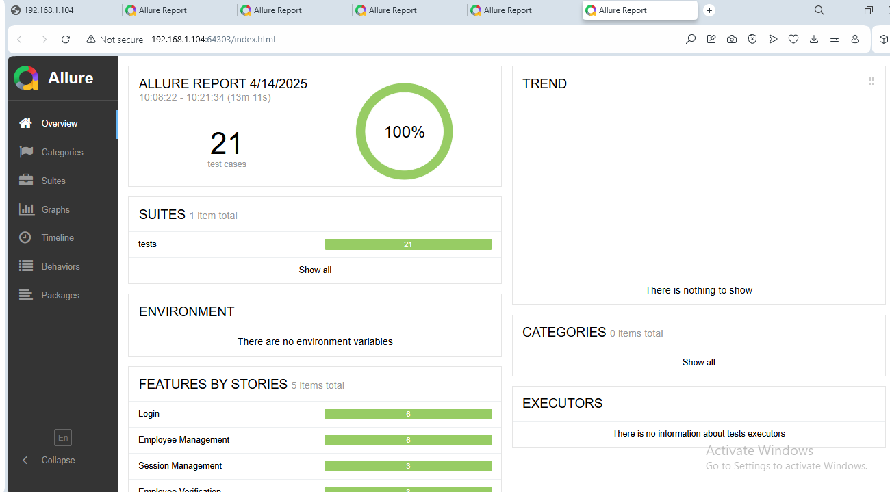
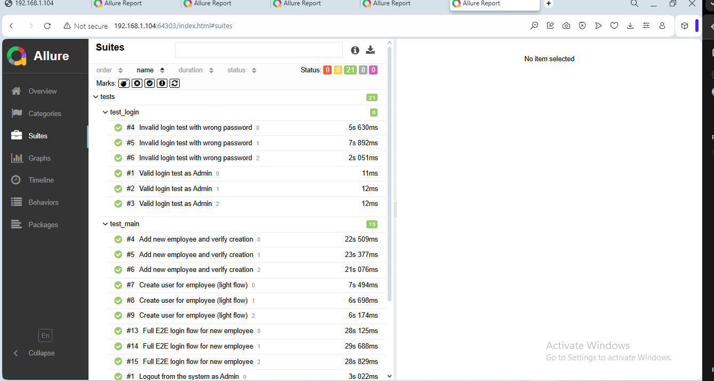
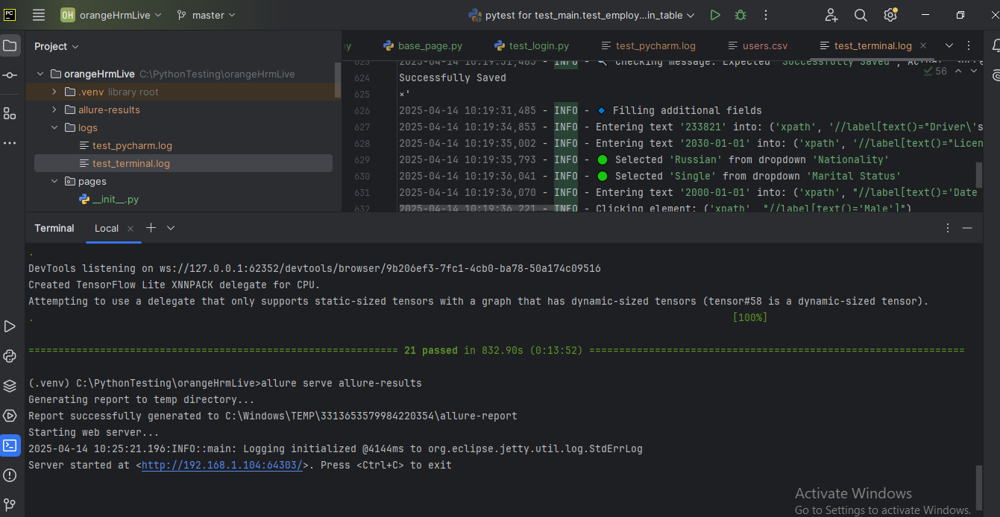

# OrangeHRM UI Automation Tests

## 🚀 CI/CD Integration
- GitHub Actions: automatic test run on every push


This project demonstrates UI test automation using Python, Selenium, and Pytest for the [OrangeHRM Open Source Demo](https://opensource-demo.orangehrmlive.com/).  
It follows the Page Object Model (POM) and includes both functional and end-to-end scenarios.

## ✅ Features

- Python + Selenium + Pytest
- Page Object Model (POM)
- Allure for reporting
- Configurable browsers (Chrome, headless mode)
- Structured logging
- Parameterized data from CSV (for employee search)

## 📂 Project Structure

```
project-root/ 
├── .github/
│   └── workflows/
│       └── tests.yml
├── pages/ # Page Object classes 
│ ├── base_page.py 
│ ├── login_page.py 
│ ├── main_page.py 
│ └── employee_page.py 
├── tests/ # Test files 
│ ├── conftest.py # Fixtures, browser setup 
│ ├── test_login.py # Login tests 
│ ├── test_main.py # Add/search employee, CSV check 
│ ├── test_employee.py # E2E scenarios 
│ └── test_logout.py 
├── utils/ # Helpers 
│ ├── config.py 
│ ├── data_helper.py 
│ └── logger.py 
├── test_data/
│ └── users.csv # Saved employee info
├── test_docs/
│ ├── orangehrm_checklist_ui.xlsx
│ └── orangehrm_testcase_ui.xlsx
├── screenshots/ # Error screenshots on failure 
├── screenshots_allure/ # Screenshots for report preview 
├── requirements.txt 
└── README.md
```

## 🚀 How to Run

1. Install dependencies:

```bash
pip install -r requirements.txt
```

2. Run all tests (GUI mode):
```bash
pytest tests/
```

3. Run in headless mode:
```bash
pytest tests/ --headless
```

4. Generate Allure report:
```bash
pytest tests/ --alluredir=allure-results
allure serve allure-results
```
## 📈 Example Test Scenarios Covered

- Valid login (Admin, Employee)
- Invalid login (wrong credentials)
- Logout
- Add employee (UI form)
- CSV save and search validation
- Full E2E: Admin creates user → user logs in

## 🖼 Allure Report Preview

### ✅ Overview


### ✅ Test Suites (Login, Employee, E2E)


### ✅ Terminal & Report



## 🚀 Continuous Integration (CI)

This project uses **GitHub Actions** to automatically run all UI tests on each push to the `master` branch.

- CI configuration is located in: `.github/workflows/tests.yml`
- Tests run in headless mode using `pytest`
- Allure reports are generated on every run
- Status badge is shown at the top of this README

## 🌐 Live Allure Report

📊 You can view the latest test results online via GitHub Pages:

👉 [Open Allure Report](https://montana054.github.io/orangehrm-ui-automation/)


## 🌐 Cross-browser Support

This project supports running tests in multiple browsers using the `--browser` CLI option.

✅ Successfully tested in:
- Chrome (default)
- Microsoft Edge (GUI and headless)

⚠️ Firefox was tested and partially working. Some tests require timing tweaks (due to loader animation).

## 📑 Test Documentation

These documents demonstrate my ability to write manual test documentation such as checklists and structured test cases.  
They are based on OrangeHRM UI functionality and demonstrate manual coverage alongside the automated test project — not as a strict 1:1 mapping to coverage.

- [UI Checklist (xlsx)](test_docs/orangehrm_checklist_ui.xlsx)
- [Test Cases (xlsx)](test_docs/orangehrm_testcase_ui.xlsx)

## 🔍 Tech Stack

- Python 3.x
- Selenium WebDriver
- Pytest
- Allure
- WebDriver Manager

## ✍ Author- 
Created by Anatolii Zakharov as part of QA Automation portfolio.